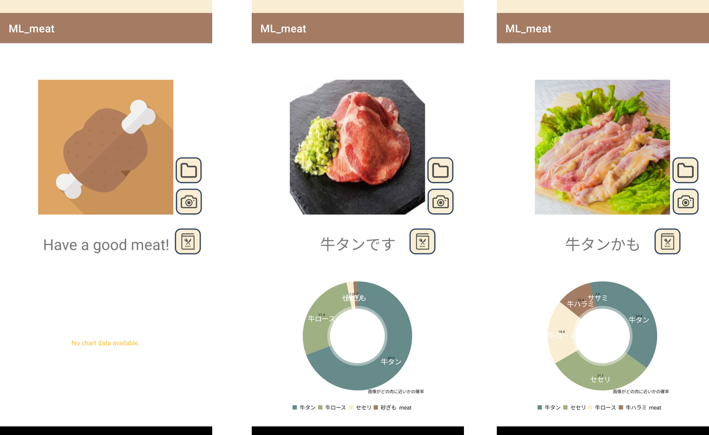

# Meat-TFLite
Meat is the app to classify meat parts from raw meat images.

</img>

# Requirements
- Android 10

# Model Training
The model used in this app was trained using [Teachable Machine](https://teachablemachine.withgoogle.com/train) and [Tensor Flow Lite](https://www.tensorflow.org/lite?hl=ja).
